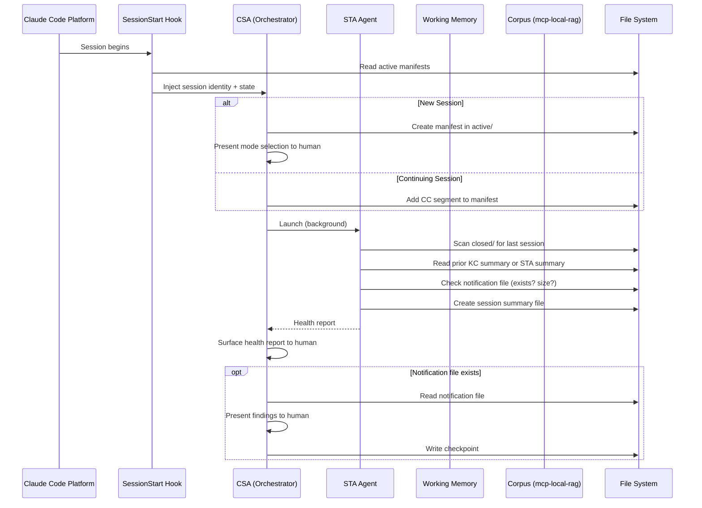
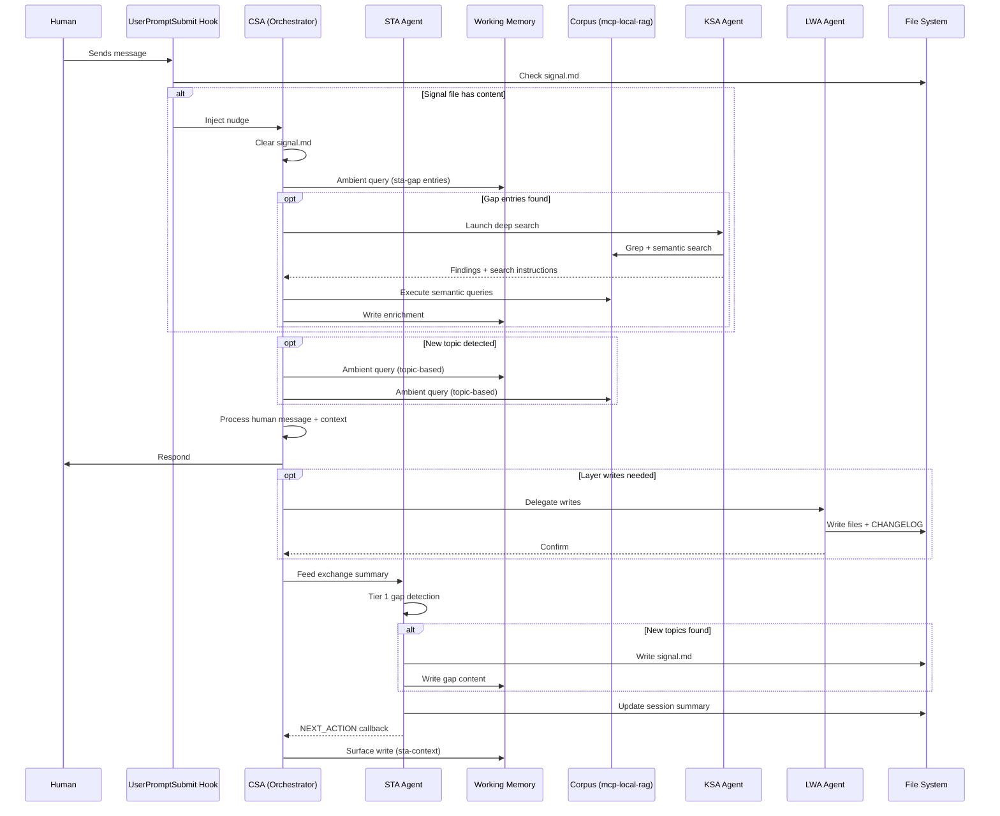
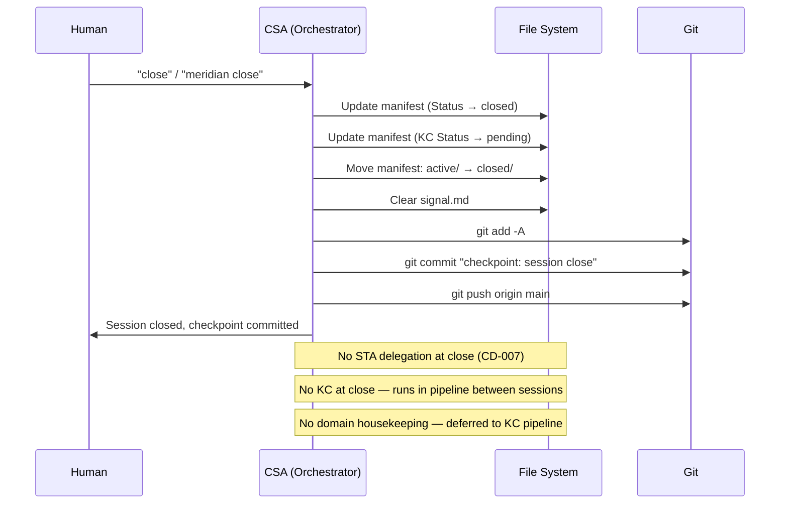
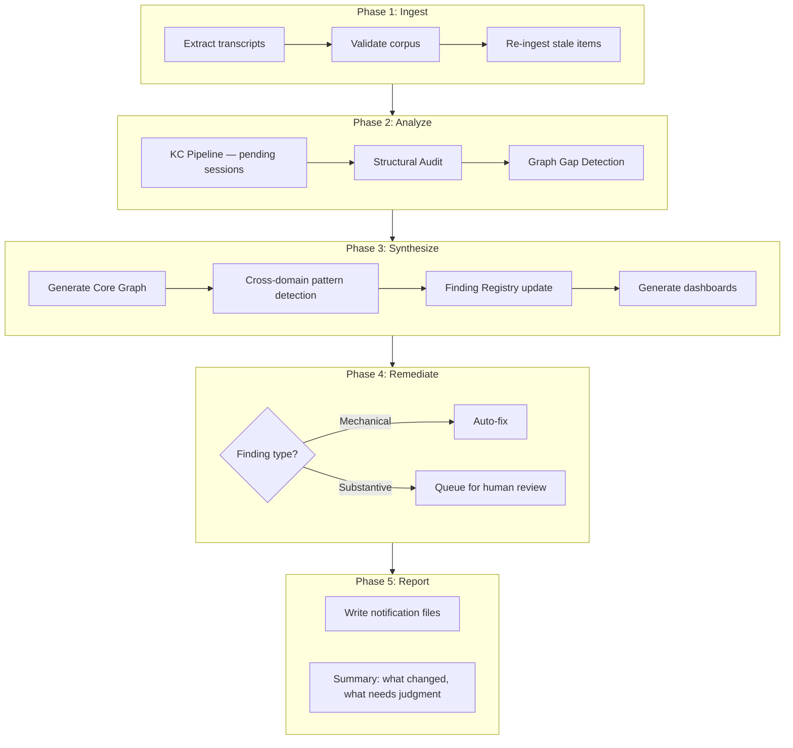
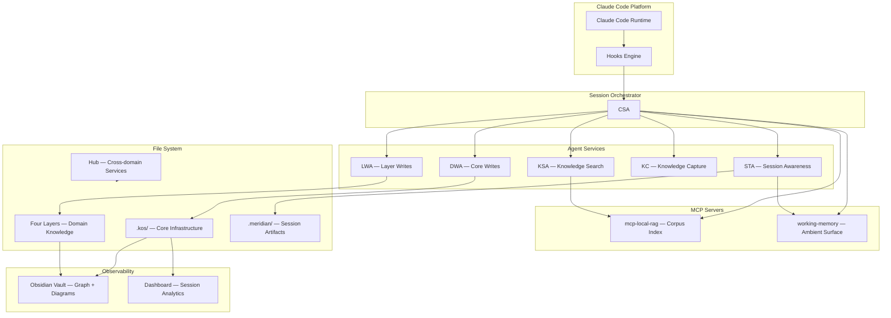

# Session Lifecycle

How a Meridian session flows from start to close. This is the runtime architecture — what happens when, and what talks to what.

## Session Start

## Exchange Cycle (Every Response)

## Session Close (Meridian Close)

## Between-Session Pipeline (Hub Sleep Mode)

## Component Topology

